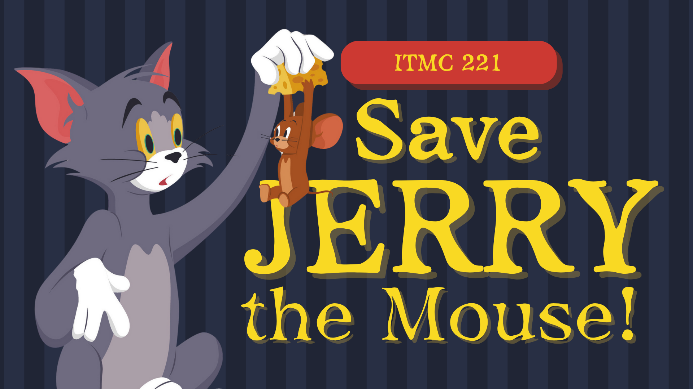
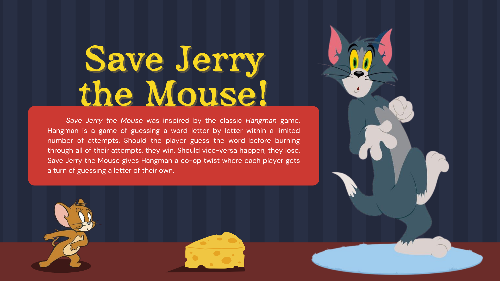
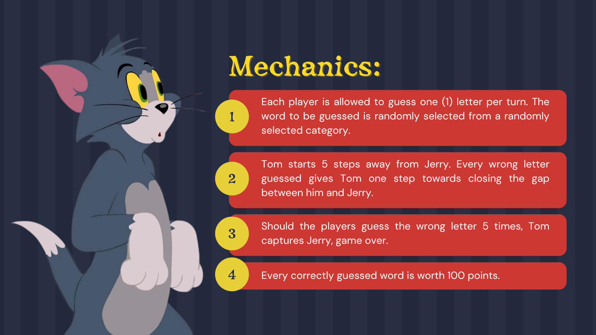

# 🎮 Save Jerry!

*A cooperative twist on the classic Hangman game using C sockets.*

  

---

## 🧩 Game Overview

  

---

## ⚙️ Game Mechanics

  

---

## 🧠 Categories

The server randomly selects a category from the following:

```
- Food
- Animal
- Color
- AdNU Building
- Fastfood Chain
```

Each category contains several words chosen randomly at runtime.

---

## 💻 How It Works

```
Server: SaveJerryServer.c
Client: SaveJerryClient.c
```

* The **server** hosts the game and randomly picks a word and category.
* The **client** connects to the server using sockets.
* Both players take turns guessing letters — one guess per turn.
* The game displays Tom’s progress toward Jerry using ASCII art.
* If all letters are guessed correctly, both players earn 100 points.
* If Tom reaches Jerry (5 wrong guesses), the game ends.

---

## 🏃‍♂️ Running the Game

### 1️⃣ Compile both programs:

```bash
gcc SaveJerryServer.c -o SaveJerryServer
gcc SaveJerryClient.c -o SaveJerryClient
```

### 2️⃣ Run the server (on one terminal):

```bash
./SaveJerryServer <port_number>
```

### 3️⃣ Run the client (on another terminal or device):

```bash
./SaveJerryClient <hostname> <port_number>
```

Example:

```bash
./SaveJerryServer 8080
./SaveJerryClient localhost 8080
```

---

## 🖥️ System Requirements

* C Compiler (e.g., GCC)
* Linux or macOS terminal (or WSL on Windows)
* Network connectivity for client-server communication

---

## 🧑‍💻 Authors

* Rivera, Ela Mariz
* Asis, Alleona Divine
* Dela Torre, Angelea
* Turiano, Almond Nicholas

---

```ascii
T  O  M   🐱    v s.   🧀  J  E  R  R  Y
Work together. Guess wisely. Save Jerry! Time is of the essence!
```
